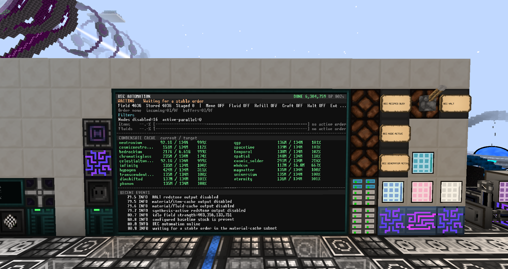

# 基于 OpenComputer 的 GTNH BEC 自动化

适用版本:GTNH 2.9.0-beta3

本目录是一套可直接部署到 OpenComputers 电脑的 BEC 集成自动化程序。它负责读取物质约束场中的凝聚态流体、识别订单、配置麦克斯韦磁通门和 16 个观测节点、在处理期间预取下一单、空闲补货，并在运行中流体不足时进入带红石联锁的自动恢复或 `HALT` 状态。

注意：可用安装器识别和写入地址；流体目标、速率和配方除数仍需按现场检查。

## 运行效果




## 文件说明

| 文件 | 用途 | 通常是否修改 |
| --- | --- | --- |
| `bec_automation.lua` | 主程序和状态机 | 否 |
| `bec_dashboard.lua` | 100x30 GPU 状态面板 | 否 |
| `bec_installer.lua` | GPU 图形安装向导：机器发现、AE 标记物识别、红石 I/O 分配和测试 | 首次或迁移时运行 |
| `bec_installer_addresses.lua` | 安装器生成的地址覆盖文件，位于 OC `/home` | 自动生成 |
| `bec_automation_config.lua` | 默认地址、流体目标、速率和配方计数配置 | 核对流体和订单参数 |
| `bec_fluid_settings.dat` | 运行时面板保存的流体目标和单次触发量覆盖文件，位于 OC `/home` | 面板自动生成 |
| `bec_route_mapper.lua` | 自动识别 19 种补货流体对应的红石 I/O 和方向 | 否 |
| `bec_route_mapper_config.lua` | 路由映射器的默认候选红石 I/O 和安全保护 | 否，若使用安装器 |
| `bec_fluid_routes.lua` | 路由映射器生成的“流体 -> 红石 I/O/方向”结果 | 自动生成 |

## 基本原理

### 四个隔离的 AE 网络

程序使用四个彼此隔离的 AE 网络。物料原料网络看不到两个目标缓存网络，整批转移由 ME 接口和红石控制的输出结构完成。

```text
主网订单
   |
   v
[物料原料网络 / income]
   | 物品整批脉冲                 | 流体整批脉冲
   v                              v
[节点物品缓存]                [纠缠装置流体缓存]
   |                              |
   v                              v
16 个观测节点                 纠缠装置 -> 约束场凝聚态缓存

[自动补货流体缓存] -- 单路 I/O 持续开启至该流体缓存达标 --> 纠缠装置
```

四个网络的职责如下：

| 网络 | OC 读取位置 | 职责 |
| --- | --- | --- |
| 物料原料网络 | `cacheInterfaceAddress` | 接收主网订单，暂存本单或下一单的物品和流体 |
| 节点物品缓存 | `buffers.itemInterfaceAddress` | 接收整批物品，并用于计算物品处理进度 |
| 纠缠装置流体缓存 | `buffers.fluidInterfaceAddress` | 接收订单流体，并用于计算流体处理进度 |
| 自动补货流体缓存 | `refill.cacheInterfaceAddress` | 空闲时按流体逐路向纠缠装置补货 |

物料网络向两个目标网络是主动整批输出。一次 1 秒脉冲表示“发送当前网络中该类物料”，目标网络不会被物料网络回读。因此程序分别读取三个 ME 接口来判断原料、物品缓存和流体缓存的真实状态。

### 一单订单的处理顺序

1. 程序等待物料原料网络的物品和流体快照稳定，防止主网正在发配时读取到半单。
2. 根据物品指纹查找 `recipeDivisors`，计算实际配方数量。未知指纹使用 `fallbackDivisor` 并输出警告。
3. 根据订单流体换算本单需要的凝聚态流体，并读取约束场当前库存。
4. 将场强提高到安全基线以上，为本单和已缓存凝聚态物质保留容量。
5. 对物料网络的流体输出发送一次 1 秒脉冲，把整批流体送入纠缠装置流体缓存。
6. 如果约束场库存不足，等待纠缠装置完成转换；库存足够时配置麦克斯韦磁通门过滤器。
7. 平均设置 16 个观测节点的并行：`min(ceil(配方数 / 16), 64)`。
8. 允许节点工作，并对物品输出发送一次 1 秒脉冲，将整批物品送入节点物品缓存。
9. 运行中以目标缓存剩余量显示物品和流体处理进度。
10. 节点物品缓存为空、所有节点均空闲且节点总并行为 0 后，本单完成并关闭生产路径。

### 运行时预取下一单

当前订单的物品进入节点缓存后，物料原料网络已经腾空，主网可以发配下一单。程序会继续观察物料网络：

- 下一单流体和物品稳定后，先把下一单流体整批送入纠缠装置缓存。
- 下一单物品仍留在物料原料网络，不会混入正在工作的节点缓存。
- 当前单完成后，已预取订单直接进入下一轮，再把对应物品送入节点缓存。
- 若运行中只出现流体而没有物品，程序将其视为可独立转移的流体批次；相同流体签名只发送一次，避免重复脉冲。
- 同配方追加发配不会用旧快照强行比较绝对数量；程序重新取得稳定快照后再更新预取订单。

### 空闲自动补货

每种源流体在 `fluids` 中独立配置：

```lua
{
  source = "molten.eternity",
  condensate = "entangled_eternity",
  unit = 144,
  target = alignedCache(128, 144),
  rateLitersPerSecond = 2880,
}
```

- `source`：自动补货网络中的普通流体名。
- `condensate`：约束场中的凝聚态流体名。
- `unit`：纠缠转换的最小处理单位。
- `target`：期望保留的凝聚态缓存量，`alignedCache(128, unit)` 中的 128 为 MiB（`1024 * 1024 mB`）；最终的 `target` 是按处理单位向下对齐后的 mB 整数。
- `rateLitersPerSecond`：直接填写流速，单位 L/s。校准器显示 `yy L / xx tick` 时填 `yy * 20 / xx`；`20 tick = 1 s`。例如 `2880 L / 20 tick` 填写 `2880`，`2880 L / 40 tick` 则填写 `1440`。该值用于预计补货耗时，实际流速由现场校准器决定。

空闲补货只在没有订单、纠缠装置已经停止、且补货功能启用时执行。程序逐种开启对应流体路由的红石 I/O，并持续读取自动补货缓存 ME 接口；网络中该源流体达到本次需求量时立即关断，再处理下一种。若有新订单则关断并先处理订单；缓存连续 `refill.routeTimeout` 秒没有增长时关断该路、记录警告，继续尝试其他流体，空闲后再重试短缺项，不会因此退出主程序。读取或控制异常仍按安全错误处理。达到目标前可能多进入校准器的一个传输周期，超出量留在缓存供后续使用。随后程序打开自动补货缓存到纠缠装置的 AE 路径。19 种流体由 10 块红石 I/O 的上、下两面控制，其中 19 面对应流体，剩余一面留空并始终保持低电平。补货接口由独立红石 I/O 整块输出控制；原现场接线位于 `eb75eb2d-10b2-40d6-941c-5e0cc80a6ab3` 的东面，迁移后以安装器识别地址为准。

### 场强管理

程序不会把场强简单固定到配置目标总和：

- 启动和空闲时，场强至少覆盖当前实际凝聚态库存和配置基线。
- 接单时，在安全基线/当前库存的较大值之上追加本单需求量。
- 预取下一单或自动恢复流体时，会在转移前提高场强。
- 若库存已经高于配置基线，会保留更高的安全场强并记录警告。

因此补货过程也会调整场强，避免新生成的凝聚态物质没有容量。

### 运行中流体不足、自动恢复和 HALT

程序按每个工作节点报告的 `required - consumed` 汇总剩余凝聚态需求，并与约束场实时库存比较。

检测到不足时立即进入 `RECOVERING`：

1. `HALT` 红石输出保持为高，`synthesis-active` 也保持为高。
2. 关闭生产路径并禁止继续启动节点。
3. 如果物料原料网络中无物品、仅有流体，对流体输出发送一次 1 秒脉冲。
4. 等待纠缠装置活动信号结束，并等待流体缓存可处理量归零或稳定。
5. 重新读取约束场库存。满足剩余需求时释放 `HALT`，恢复节点并返回 `RUNNING`。
6. 原料网络中的恢复流体不可用、转换结束后仍不足、或等待超时，则保持外部 HALT 联锁，继续显示 `RECOVERING` 并尝试使用自动补货网络补齐当前活动节点仍缺少的凝聚态种类。
7. 自动补货只针对当前短缺量：持续开启对应流体路由，待自动补货缓存达到本次需求后关断，再通过独立补货接口送入纠缠装置。若该路连续 `refill.routeTimeout` 秒没有缓存增长，立即关断并退出 `RECOVERING`，显示 `HALT` 提示人工补流体；不会再次自动开启该路。该过程不会因为下一单已经进入原料网络而中断，也不会补齐无关的全部基线库存。
8. 自动补货尝试结束后，程序继续比较活动节点的剩余凝聚态需求与约束场库存。全部达标且节点仍保留有效的在制配方和非零并行时，程序先重新允许麦克斯韦门与节点工作，再释放 HALT 红石，自动返回 `RUNNING` 继续本单。
9. 自动补货没有取得足够流体时保持 `HALT` 联锁并持续监控，等待人工补足约束场库存。节点仍保留有效在制配方且库存达标时，原有监测逻辑可以恢复本单；如果节点在制配方状态已经消失，不会仅因库存达标而误释放，需要人工排查。

 `haltAddress` 的外部红石必须真正停止当前处理。当前现场方案是回收蜂群并关闭观测阵列；只接一个指示灯不具备保护作用。

### 状态面板

建议使用 100x30 屏幕。面板显示：

- 当前状态和运行时间；
- `DONE` 已处理配方总数；
- 本单物品进度和流体进度；
- 约束场缓存、场强、配方指纹、并行数和节点状态；
- 纠缠装置活动反馈、麦克斯韦门过滤器和最近日志。

主要状态：

| 状态 | 含义 |
| --- | --- |
| `STARTING` | 绑定组件并施加安全初态 |
| `WAITING` | 等待稳定订单 |
| `STAGING` / `READY` | 正在接收或已预取下一单 |
| `REFILL` | 空闲自动补货 |
| `PREPARING` | 提高场强、转移流体、配置门和节点 |
| `RUNNING` | 本单处理中 |
| `RECOVERING` | 已保持 HALT 输出，正在尝试补入缺失流体 |
| `HALT` | 自动补货失败或无增长后联锁保持；等待人工补流体并持续检查库存 |

累计数保存在 `/home/bec_processed_recipes.dat`，并使用 `/home/bec_processed_recipes.dat.bak` 作为第二份有效副本；重启电脑后继续累计。同时删除这两个文件才会清零。

点击状态面板第 10–20 行的凝聚态缓存显示区可进入 `FLUID CONFIG`。运行中的点击先显示 `CONFIG QUEUED`；程序只在没有新订单、纠缠流体缓存为空且纠缠装置停止的空闲阶段打开编辑页。编辑页暂停接单和自动补货，完成后重新读取原料网络，不会把编辑期间新发配的订单按旧快照处理。请勿在编辑页长时间停留或依赖它维持运行中配方的监控。

编辑页显示 19 种流体：点击 `CACHE MiB` 或 `L/s` 数值开始输入，按 Enter 应用当前值，Esc 取消当前输入；也可用上下键选流体、左右键选字段、Enter 开始输入。按 `S` 或点击左侧 `SAVE` 保存，按 `Q` 或点击右侧 `CANCEL` 放弃。缓存目标以 MiB（`1024 * 1024 mB`）输入，程序会向下对齐到该流体的处理单位；`L/s` 填写现场校准器的 `yy * 20 / xx`，最多保留三位小数，只更新程序预计流速，不会远程修改物理校准器。现场更改校准器后应同步更新此栏。

保存时程序先验证并按新缓存基线提高场强，再写入 `/home/bec_fluid_settings.dat` 并立即应用；保存失败不更新正在运行的目标和流速。重启后此文件覆盖 `bec_automation_config.lua` 中对应 19 种流体的 `target` 与 `rateLitersPerSecond`，不覆盖流体名、处理单位和配方参数。修改 Lua 文件里的默认值后若未生效，应检查这个覆盖文件；旧版本备份为 `.bak1` 等。新文件使用 `schemaVersion = 3` 且必须包含全部 19 种流体；旧版文件不兼容，部署前先将 OC 上已有的 `/home/bec_fluid_settings.dat` 移走，再用配置页重新填写并保存。降低目标不会强制降低已保留的安全场强。

## 硬件与连接

### OC 电脑

电脑需要安装 OpenOS，并具备：

- T3机箱、内存、硬盘与APU, 建议使用 100x30 的屏幕；
- 足量 OC 网络线缆、分线器和适配器；
- 约束场、麦克斯韦磁通门、16 个观测节点和 4 个 ME 接口均接入同一 OC 组件网络；
- 所有固定红石 I/O 和 10 个补货路由红石 I/O 均接入该 OC 网络。

电脑无需 `Network` 扩展包或无线网卡。需要跨距离时可按现有机器布局使用 MFU，但 UUID 仍以 `discover` 的实际结果为准。

### 固定红石 I/O

以下六路不参与流体路由自动探测：

| 配置字段 | 方向 | 输入/输出 | 作用 |
| --- | --- | --- | --- |
| `redstone.nodeAddress` | 全六面 | 输出 | 物料原料网络 -> 节点物品缓存，整批物品 1 秒脉冲 |
| `redstone.generatorAddress` | 全六面 | 输出 | 物料原料网络 -> 纠缠装置流体缓存，整批流体 1 秒脉冲 |
| `redstone.synthesisAddress` | 全六面 | 输出 | 本单开始到安全结束期间保持高电平 |
| `redstone.haltAddress` | 全六面 | 输出 | `RECOVERING/HALT` 联锁；必须实际暂停蜂群/观测阵列 |
| `refill.entanglerAddress` | 全六面 | 输出 | 自动补货缓存 -> 纠缠装置的 AE 路径总控 |
| `refill.activityAddress` | 任意一面 | 输入 | 纠缠装置正在工作时为高电平；程序读取六面的最大值 |

纠缠装置活动输入可使用无线活跃探测盖板汇总：配置为机器工作时发出信号，接到 `activityAddress` 任意一面。程序在该信号为高时不会仅靠固定延迟判定转换超时。固定输出在六面同时发出高/低电平，因此每个作用必须使用独立红石 I/O，其他面不得接入会被误触发的设备；输入 I/O 也不要复用为输出。

### 补货路由红石 I/O

`bec_route_mapper_config.lua` 从安装器生成的 `/home/bec_installer_addresses.lua` 读取 10 块专用红石 I/O，不保留旧地址作为后备。程序测试每块的 `down` 和 `up`，共 20 路：

- 19 路分别控制 19 种源流体；
- 剩余 1 路不接设备，路由文件将其记录为 `unusedOutput`，主程序不会驱动该面；
- 补货缓存的 ME 接口输出由 `refill.entanglerAddress` 指定的独立红石 I/O 整块控制，不属于这 20 路；
- 19 个有效路由的高电平都必须只放行对应源流体；
- 每路流体校准器需按 `yy L / xx tick` 配置，将 `yy * 20 / xx`（L/s）写入 `rateLitersPerSecond`，并在现场确认持续高电平可按校准器周期传输；主程序按缓存实际数量停机。

`protectedControls` 会直接引用 `bec_automation_config.lua` 中的固定控制和活动输入地址。它不是主程序的第二份控制配置，也不会写这些端口；路由映射器只读取并保护它们，发现固定 I/O 混入候选路由设备、输出面不为低电平或组件缺失时会拒绝探测。迁移机器时用安装器更新地址，保护列表会自动跟随，无需再次抄 UUID。

## 安装与配置

### 1. 复制程序

将发布目录下六个程序/配置 `.lua` 文件复制到 OC 电脑的 `/home`；不要复制现场旧的地址覆盖文件或旧的流体路由文件：

```text
/home/bec_automation.lua
/home/bec_dashboard.lua
/home/bec_installer.lua
/home/bec_automation_config.lua
/home/bec_route_mapper.lua
/home/bec_route_mapper_config.lua
```

保留原文件名，因为程序使用 `require()` 按这些名称加载模块。安装器会生成 `/home/bec_fluid_routes.lua`，不应直接复用发布目录中的示例映射。

### 2. 运行地址安装器

先停止主程序和路由映射器，确保不会在识别期间发配订单；机器、16 个节点、4 个网络的 ME 接口和 16 块红石 I/O（固定 6 块、补货路由 10 块）都必须接入同一 OC 组件网络。电脑需要 GPU、屏幕和键盘，当前屏幕分辨率至少为 80x20；推荐 100x30。每个 AE 网络需要临时物品存储，以便放入和取出一件标记物品。运行：

```sh
bec_installer.lua
```

安装器全程在 GPU 图形界面中操作：用触摸或键盘选择机器、确认步骤、检查结果。它自动发现约束场、磁通门和恰好 16 个节点。然后按屏幕顺序分别在物料原料、节点物品缓存、纠缠流体缓存、自动补货缓存网络放入独特物品，并在提示时取出。它比较所有已连接 ME 接口的物品库存变化；只有恰好一个接口变化、放入数量增加且取出后恢复原库存才接受该网络。期间不能有其他库存变化；纯流体网络也需临时安装物品存储，完成后可移除。

红石配置表为 `ADDRESS`、`ROLE`、`TOGGLE` 三列。上下键或触摸选择设备，左右键或点击作用单元格左侧选择：`NODE` 物品整批输出、`FLUID` 流体整批输出、`CRAFT` 合成活动输出、`HALT` 联锁输出、`REFILL_LINK` 补货路径总控、`ACTIVE_INPUT` 纠缠装置活动输入、`ROUTE` 补货流体路由。补货路由在作用栏显示 `ROUTE [UP]` 或 `ROUTE [DOWN]`，按 `F` 或点击该栏的方向标记切换测试面。`TOGGLE` 是现场测试开关，不是业务配置：点击 `OFF`（或按 `T`）立即变成 `ON/HIGH`，随后按 1 秒高、1 秒低持续闪烁；再点 `ON`（或按 `T`）关断并核验输出为 0。同一时间只测试一块 I/O，切换被测设备、作用或方向以及保存、取消时都会先关断。活动输入只显示 `READ`，点击后读取六面的最大输入强度，不会输出。持续脉冲可能实际触发物料或释放 HALT，必须先隔离危险负载。`S` 或屏幕按钮校验必须各有一个固定作用及恰好 10 块路由设备，然后进入保存确认页；`Q` 或取消按钮不保存退出。

安装器保存 `/home/bec_installer_addresses.lua` 后，会自动执行路由只读检查和 20 面流体探测，在 GUI 中显示进度，并生成 `/home/bec_fluid_routes.lua`。探测前自动补货缓存必须为空，期间不得手动输入流体或启动主程序。地址覆盖文件和旧的完整路由文件分别备份为 `.bak1` 等；若映射不足 19 种，结果写入 `.partial.lua`，旧完整映射仅在备份中，不会作为当前路由继续运行。安装器不修改流体目标、速率、指纹除数，也不启动主自动化。重跑时会从当前配置预选已连接的红石地址。只需排障查看地址时可执行 `bec_automation.lua discover`。

映射成功后安装器会显示补货缓存中的测试流体总量，并让你选择是否打开 `REFILL_LINK` 将其送入纠缠装置。按回车时，若缓存有流体，先确认约束场正在运行且纠缠装置输入流体缓存为空，再把场强提高到不低于“现有凝聚态库存 + 补货缓存流体量”，然后整块打开补货链路。安装器不会主动等待或判断纠缠完成；选择打开后链路会保持开启，最终页面提示你在现场等待流体纠缠结束。完成后按回车或 `Q` 退出，安装器会关断并核验 `REFILL_LINK` 红石输出；发生错误而退出时也会尝试关断。选择跳过则不会打开链路，流体留在补货缓存。提高过的场强不会被安装器降低。

如果 router 在探测前发现补货缓存仍有流体，安装器会暂停并显示缓存余量与 `REFILL_LINK` 的 `OFF/ON` 开关。按 `T` 或点击左侧可打开链路，将残留流体送往纠缠装置；再按一次可关闭。按回车或点击中间 `RECHECK` 时会先关断并核验链路，再重新读取且等待缓存稳定；仍非空则继续显示该页面。按 `Q` 或点击右侧取消时也先关断。映射探测期间链路必须保持关闭，否则测试流体会被转走。独立运行 `bec_route_mapper.lua run 30` 时仍可清空后按回车重试，但没有安装器的 GUI 开关。


未选择作用（`ROLE` 为 `-`）时也可直接点击 `OFF` 开始持续闪烁，便于先识别线路再分配作用。此时六面都会输出；未知设备可能同时连接两路补货流体，测试前务必隔离不应动作的负载。只有分配为 `ROUTE` 后测试才限定在作用栏标出的上面或下面。

### 3. 配置自检

执行：

```sh
bec_automation.lua check
```

该命令绑定组件并打印：机器、三个订单相关 ME 接口、固定红石 I/O、补货接口、活动输入、19 种流体目标/速率、麦克斯韦门和 16 个节点。必须先修复所有地址、组件类型、方法或路由错误，再继续。


### 4. 单轮试运行

先用小订单执行一次：

```sh
bec_automation.lua once
```

观察完整过程：订单稳定、流体进入纠缠缓存、场强上调、磁通门过滤器设置、物品进入节点缓存、进度下降、节点空闲、生产路径断开。测试结束后还应确认物料原料网络、节点物品缓存和纠缠流体缓存没有异常残留。

建议另外制造一次可控的凝聚态不足，确认面板进入黄色 `RECOVERING`、HALT 输出保持高、流体转换完成后能自动恢复。让原料网络没有可用恢复流体时，应转为红色 `HALT` 并从自动补货网络逐路提取短缺流体；确认只触发需要的流体路由、补货接口由独立的 `REFILL_LINK` 红石 I/O 控制，并在库存达标后无需重启即可返回 `RUNNING`。测试期间还要确认自动补货失败时联锁继续保持，以及节点在制状态消失时 HALT 不会自动释放。

### 5. 正式运行

```sh
bec_automation.lua run
```

日志写入 `/home/bec_automation.log`。主程序退出或报错时会尽力关闭传输路径；但若已经进入 `HALT`，错误清理会故意保留 HALT 与合成活动输出，避免外部设备被错误释放。排障后重新运行程序，安全初始化才会重新施加完整初态。

需要开机启动时，可在确认 `run` 稳定后，把启动命令加入 OpenOS `/etc/rc.local`。


## 常见问题

### 红石地址报错 `must be a component address or unique prefix`

配置中的 UUID 不存在、只复制了错误前缀，或该红石 I/O 没有接入当前 OC 网络。用 `discover` 重新确认完整地址。UUID 不是红石频道名。

### 脉冲后没有物料进入目标网络

程序的整批传输脉冲默认是精确 1 秒。检查 `nodeTransferPulse`、`orderFluidTransferPulse`、红石方向、ME 输出结构、触发总线逻辑和目标网络供电。

### 配方完成后没有断开

完成条件不是只看物料原料网络。程序要求节点物品缓存为空、全部节点空闲、总并行为 0；纠缠装置仍工作时还会等待其活动输入结束，之后才允许空闲补货。检查目标缓存 ME 接口是否可读，以及节点状态方法是否正常返回。

### 配方数量识别成倍错误

查看日志中的 `fingerprint`、识别数量和实际产量。确认主网没有在快照稳定期间继续追加原料，然后为该指纹设置正确的 `recipeDivisors`。例如 `4f5dd565` 的当前现场除数为 `4`。

### `RECOVERING` 后仍进入 `HALT`

`RECOVERING` 会先尝试从自动补货网络提取当前短缺流体；无缓存增长时关断路由，进入 `HALT` 等待人工补流体。依次检查：`refill.enabled` 是否开启、对应流体路由及配置流速是否正确、自动补货缓存是否收到流体、独立 `REFILL_LINK` I/O 是否连接纠缠装置、纠缠活动输入是否变化、场强是否足够、麦克斯韦门过滤器是否对应本单，以及 HALT 外部电路是否真正暂停处理。补足缺失凝聚态后，只要节点仍保留有效的在制配方，程序会自动恢复；日志显示 `active node recipe state is unavailable` 时无法继续原配方，应人工检查节点状态后再决定是否重启。

### 麦克斯韦磁通门过滤器异常

磁通门由 OC 的 `getCondensateFilterAt` / `setCondensateFilterAt` 配置。不要在磁通门结构中放普通流体输入仓作为固定过滤来源；GT 的机器逻辑会按输入覆盖过滤器，导致 OC 设置被改写。
